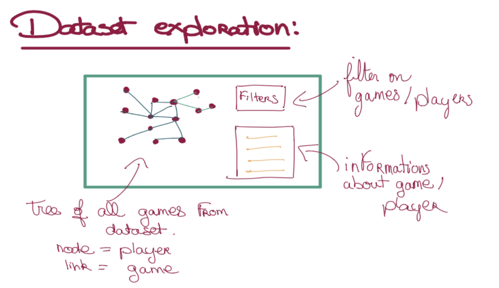

# Milestone 2

**10% of the final grade**

The website will contain ideally five different visualisations, each one of them giving a different insight on the dataset and on chess in general. We will have a visualisation of the pieces’ moves, a heatmap of the distribution of the pieces’ positions,a sunburst plot visualising the openings in the dataset, a geographical timeline of chess history, and a graph with players and games relationships in the dataset.
The home page would be simple, only containing the title of the project, and a small description. There will also be a link to the pieces’ moves page, for beginners who have no knowledge about chess at all. On the home page, the user would be invited to scroll down. When scrolling down, they can see outlines of the five visualisations, with titles and catch-phrases to make them want to click, and go to the visualisation’s page.

### Sketches of the visualizations

The first one is the pieces moves page - for the beginners. There will be on top a line with all the chess pieces drawn, and they can select the ones they are interested about. When selected, the mentions of Worst enemy and Favorite victim appear under respectively, the piece that captured them the most, and the piece that they captured the most, over all the dataset. The selected piece will also appear bigger to the left, with an interactive chess board to the right, demonstrating the piece’s legal moves and how they can capture. When scrolling on the page, the user will see more detailed statistics about who they captured and were captured by.

The second visualisation is a sunburst plot describing the different openings. It would be like a tree structure, in the form of a sun, where at the root there are the biggest families of openings, and the higher you hover on the rays, the more advanced you go through the opening. At the same time, while hovering on the openings, there will be statistics on how frequently the players who use these openings are winning. Additionally, when hovering on the sunburst, the related opening is played on a chess board on the right, to visualize better what they mean. It is also possible to go the other way around : the user can move pieces on the chess board and that will highlight in the sunburst plot the opening they are using, with the statistics that go with it. There will also be two buttons to undo or reset the moves on the chessboard, to let the user play however they want with the visualisation, and explore the different openings.

On this third visualisation, one can have a more general overview on the different games at different levels. They can select the level they want to visualize with the buttons at the bottom, and compare which squares on the chess board are the most occupied. That will allow them to understand, for example, that players at a high level are controlling the center of the board, so these are important squares to focus on while playing. The visualisation itself would be a heatmap corresponding to a chess board, where the squares are darker when they are occupied a lot.

The next visualisation is a graph of all the players, to provide a way to explore the dataset endlessly. The nodes would represent the players, and the games will be the links between them, if they have played one against the other. When clicking on the node or the link, there will be information about the player or the game displayed on the right. There will also be a possibility to filter on the games or players, to look at smaller graphs of interest.

Finally, there will be a way to learn more about chess history and visualize events all over the world. There will be a timeline on the right that one can zoom in and out, select one event, read about it and visualize it geographically on the map.

### List of the tools for each visualisation

- Piece moves :
The page with the basic pieces’ moves will use the chessboard.js library to display a chess board, with chess.js to allow the user to test the different legal moves of each piece. We will also make use of d3.js to create the bar plots for the statistics of each piece over the dataset.

- Position heatmap :
The heatmap will be created using D3 to create the grid, the axes and the colors. We will use d3 tooltip to display information on a square by hovering over it. The lecture on interactions will be useful for the animations and transitions, when the user changes the elo range.
	
- Sunburst plot :
For the chessboard, we will use the chessboard.js library to display the board along with chess.js to enforce chess rules and only allow legal moves. The sunburst plot will be created using D3 and d3-hierarchy.js. Both parts will interact through D3.The Graphs lecture will be useful for the Radial layout, the trees and the Hierarchical visualizations.

- Geographical timeline :
The map is created using d3-geo-projection.js and the timeline and interactions use D3. The lecture on Maps talks about choropleth maps and the “More interactive d3” lecture talks about dynamic scales and axes, which is how we want to implement the timeline.

- Dataset exploration Graph :
The core component is naturally the graph, which will be rendered with the Cytoscape.js library. In addition to it, we need to create dynamic filters, and to display information about the nodes and edges that the user hover. To do that we will use mainly pure CSS/JS. We will also include the ChessBoard component (already used in previous visualizations) to display the corresponding game.
Naturally, the lecture on graphs is important for this visu.

### Break down of the goal

The main goals of our project is to create interest in chess, give some insights to players and design visualizations adapted to different backgrounds. The piece moves is an introduction to new players, explaining how different pieces are allowed to move. The position heatmap may be useful to amateur players who know how to play but don’t know any theory while the sunburst plot lets players explore openings, which is a concept for more advanced players, yet still interesting for everyone.

- Piece moves:
This visualisation is intended for beginner players. There will be a list of pieces to choose from. Then informations about the selected piece will appear : general description, a chess board that illustrates the different moves of the piece, where the piece stands at the beginning of the game, and general pre-computed stats about the piece

- Position heatmap:
This visualization is for amateur players, as an introduction to chess theory. This heatmap aims to show the depth of playing chess to players playing superficially. The heatmap can be decomposed in two parts: the grid and the buttons to choose the elo range. The chessboard is interactive such that hovering over each square displays some information.

- Core: Sunburst plot:
The sunburst plot is for more advanced players and is designed as a playground to explore the openings, such that each player can satisfy their own curiosity and interest. The players can see the use percentage, the win rate as well as the opening names. The visualization is in two parts: the radial layout plot and the chessboard. The radial layout gives information on the openings and the chessboard lets players check information on the sequences of move of their choice. Both are connected: hovering over an opening in the radial layout displays the position on the chessboard, while moving pieces around on the chessboard highlights the current openings along with its information.

- Extra idea: Geographical timeline
This timeline has the objective to create interest for chess in a visual manner, by showing anecdotes and historical facts along with the country where events occurred. The timeline is interactive, hovering over an event displays its description and highlights the adequate region, and the user can zoom or drag it to their period of interest.

- Extra idea: Dataset exploration Graph 
The idea of the graph is to offer an alternative and intuitive way to navigate through parts of the dataset. It can also offer some insights on the data. As presented in previous sections, the implementation can be broken down into the following parts : graph generation, dynamic filtering, information box on the nodes/edges, and chessboard.

Link to the [website](https://com-480-data-visualization.github.io/data-visualization-project-2021-rookies/)

